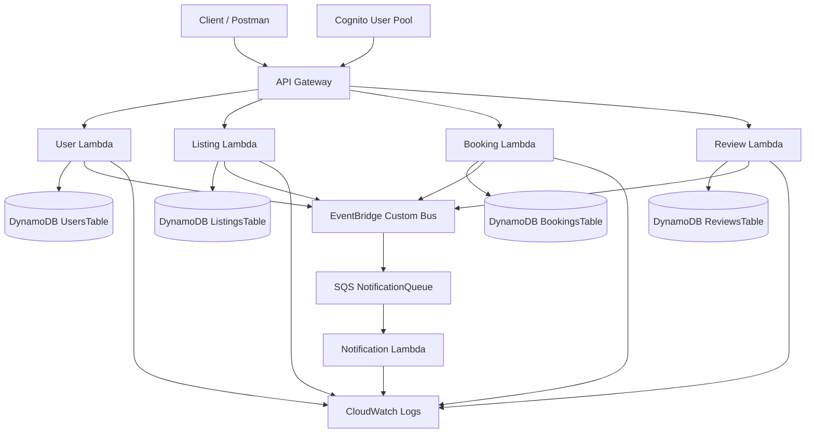
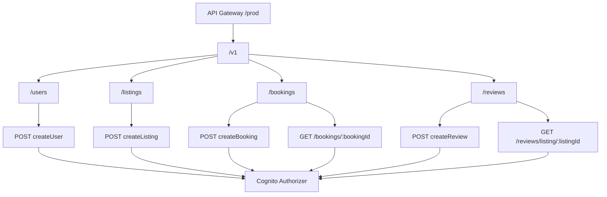
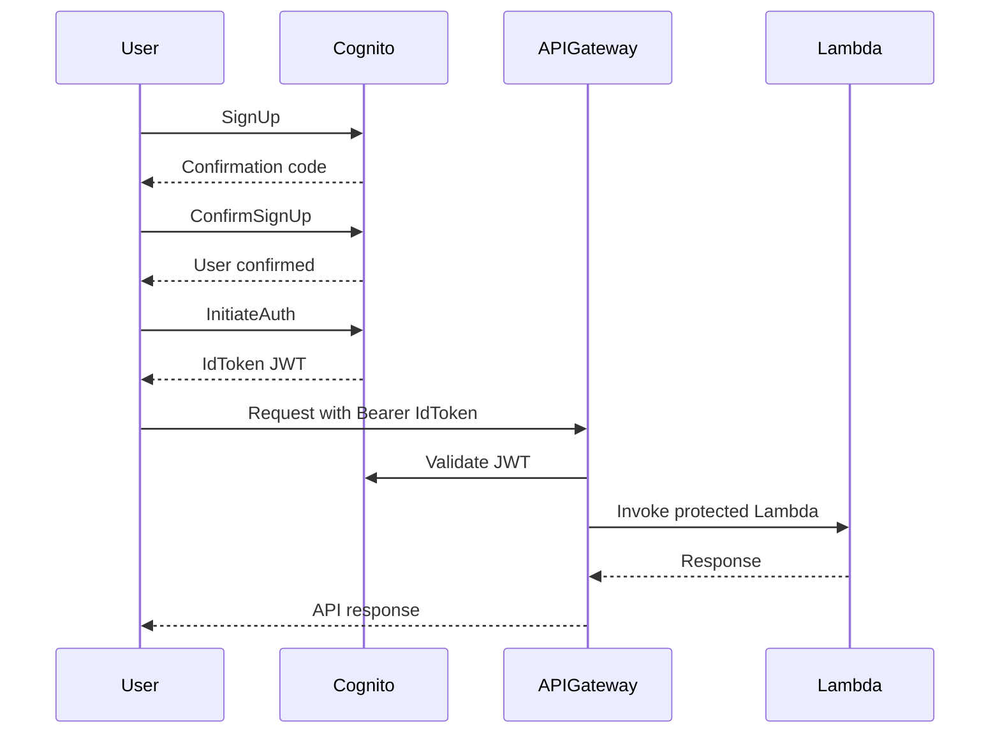
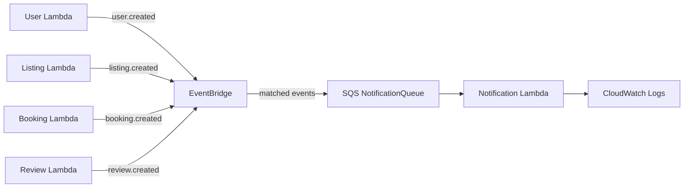
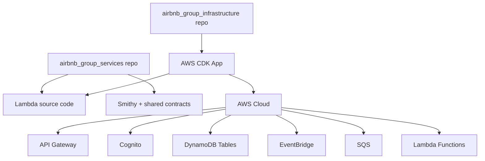

# Airbnb Group Infrastructure

Repositorio de infraestructura en AWS CDK para el proyecto de Airbnb (microservicios).

Este repo crea recursos en AWS y empaqueta Lambdas cuyo codigo fuente vive en un repo hermano:

- `../airbnb_group_services`

## Proyecto multi-repositorio

Este repositorio forma parte de un sistema compuesto por infraestructura, servicios, frontend y MLOps. La guia central con URLs Git, estructura local, instalacion, ejecucion y despliegue se encuentra en:

- [Guia de ejecucion multi-repositorio](docs/MULTI_REPO_SETUP.md)
- [Servicios](https://github.com/quiquex222333/airbnb_group_back)
- [Frontend](https://github.com/quiquex222333/airbnb_group_front)
- [Modelo y entrenamiento MLOps](https://github.com/quiquex222333/protecto_modulo_15)

## Alcance

Este stack crea y conecta:

- API Gateway REST (`/v1/*`)
- Cognito User Pool y App Client
- DynamoDB (`UsersTable`, `ListingsTable`, `BookingsTable`, `ReviewsTable`)
- EventBridge Bus
- SQS Queue para notificaciones
- Lambdas Node.js 20 (handlers en el repo de servicios)

## Diagramas

### Arquitectura AWS General



### Enrutamiento API Gateway



### Flujo de Autenticacion con Cognito



### Arquitectura Event-Driven



### Vista de Despliegue entre Repos



## Dependencia con `airbnb_group_services`

Los `NodejsFunction` usan rutas absolutas calculadas desde este repo hacia:

- `../airbnb_group_services/services/*/src/handler.ts`

Estructura esperada en disco:

```txt
arq_nube_microservicios/
|-- airbnb_group_infrastruture
`-- airbnb_group_services
```

> Nota: el nombre actual de carpeta es `airbnb_group_infrastruture` (sin "c" en "infrastructure").

## Prerequisitos

- Node.js 20+
- npm 10+
- AWS CLI configurado (`aws configure`)
- AWS CDK v2 (`npm i -g aws-cdk` o `npx cdk`)
- Permisos AWS para CloudFormation, IAM, Lambda, API Gateway, Cognito, DynamoDB, EventBridge y SQS

## Inicio rapido

1. Instalar dependencias del repo de servicios (obligatorio para bundling de Lambdas):

```bash
cd ../airbnb_group_services
npm install
```

2. Instalar dependencias de infraestructura:

```bash
cd ../airbnb_group_infrastruture
npm install
npm run build
```

3. Bootstrap de CDK (solo la primera vez por cuenta/region):

```bash
npx cdk bootstrap
```

4. Sintetizar y desplegar:

```bash
npx cdk synth
npx cdk deploy
```

### Deploy unificado (infra + frontend)

Al ejecutar `cdk synth/deploy` desde este repo, el script `bin/cdk.ts` ahora compila automaticamente el frontend (`../airbnb_group_front`) antes de sintetizar el stack.

- Fuerza `VITE_API_URL=/v1` por defecto para que el frontend use la misma distribucion CloudFront y no quede atado al API ID de API Gateway.
- Esto evita tener que redeployar el frontend cuando se recrea el stack y cambia el dominio `execute-api`.

Variables opcionales:

- `FRONTEND_BUILD_API_URL`: sobrescribe la base del frontend en build (default: `/v1`).
- `SKIP_FRONTEND_BUILD=1`: omite la compilacion automatica del frontend.

Variable obligatoria:

- `FRONTEND_URL`: origen permitido en CORS para API/Lambdas.
  - En local: `http://localhost:5173`
  - En produccion: dominio real del frontend (idealmente un dominio estable propio, no uno temporal).

## Comandos utiles

```bash
npm run build         # Compila TypeScript
npm run watch         # Compilacion en modo watch
npm run cdk -- synth  # Genera CloudFormation template
npm run cdk -- diff   # Muestra cambios contra stack desplegado
npm run cdk -- deploy # Despliega stack
npm run cdk -- destroy # Elimina stack
```

## Endpoints desplegados

Todos los endpoints usan authorizer Cognito.

- `POST /v1/users` -> `createUser` (`user-service`)
- `POST /v1/listings` -> `createListing` (`listing-service`)
- `POST /v1/bookings` -> `createBooking` (`booking-service`)
- `GET /v1/bookings/{bookingId}` -> `getBookingById` (`booking-service`)
- `POST /v1/reviews` -> `createReview` (`review-service`)
- `GET /v1/reviews/listing/{listingId}` -> `getReviewsByListing` (`review-service`)
- `POST /v1/ml/predict` -> `predictSegment` (`ml-service`)

## Outputs del stack

Despues de `cdk deploy`, guarda estos outputs:

- `ApiUrl`
- `UserPoolId`
- `UserPoolClientId`
- `EventBusName`
- `NotificationQueueUrl`
- `NotificationQueueName`

## Flujo de eventos

- Existe una regla EventBridge `UserCreatedRule` que escucha:
  - `source: user.service`
  - `detailType: user.created`
- La regla enruta mensajes a `NotificationQueue`.
- `NotificationLambda` consume `NotificationQueue`.

Estado actual a tener en cuenta:

- `listing-service`, `booking-service` y `review-service` publican eventos (`*.created`).
- `user-service` aun no publica `user.created` en el codigo actual del repo de servicios.

## Troubleshooting rapido

### Error: no se encuentra `airbnb_group_services`

Verifica que ambos repos esten al mismo nivel. Si no, ajusta `servicesRoot` en `lib/cdk-stack.ts`.

### Error de bundling: modulo no encontrado

Ejecuta `npm install` en `../airbnb_group_services` antes de `cdk synth/deploy`.

### Error: `package-lock.json` no encontrado en services

Este stack usa `depsLockFilePath` apuntando a `../airbnb_group_services/package-lock.json`.
Asegurate de tener ese archivo en el repo hermano.

## Documentacion adicional

- [Arquitectura del stack](docs/ARCHITECTURE.md)
- [Integracion con repo de servicios](docs/SERVICES_REPO_INTEGRATION.md)
